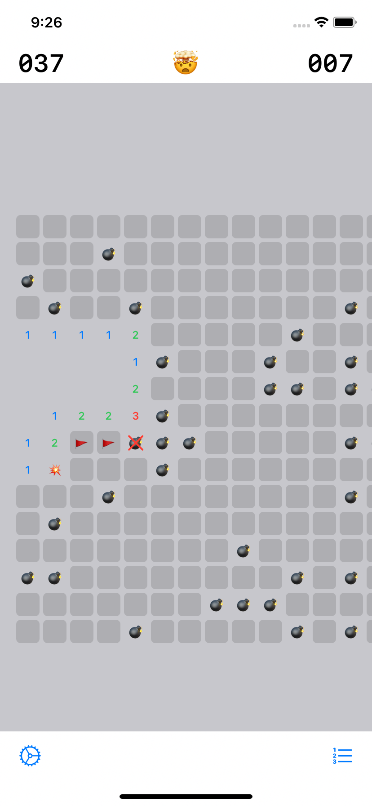

## Minesweeper

This project is a copy of the Windows game Minesweeper.

## About

Minesweeper is an iOS & Mac Catalyst application built entirely in Swift. The logic is build in the [Composable Architecture](https://github.com/pointfreeco/swift-composable-architecture) and the UI is built in SwiftUI.

The project shows following use cases:

* Highly modularized: every feature is isolated into its own module with minimal dependencies between them, allowing us to compile and run features in isolation without building the entire application.
* Fully controlled side effects. Every feature is provided with all the dependencies it needs to do its work, which makes testing very easy.
* The core logic of the application is put into modules named like *Core, and they are kept separate from modules containing UI, which is what allows us to share code across multiple platforms (SwiftUI and UIKit), but could also allow us to share code across iOS, macOS, watchOS and tvOS apps.
* Comprehensive test suite for every feature, including integration tests of many features working in unison, and end-to-end testing of side effects.

## Screenshots

| Game | High Scores | Settings |
|---|---|---|
|  |  |  |

| Mac Catalyst |
|---|
||

## License

The source code in this repository may be run and altered for education purposes only and not for commercial purposes. For more information [see LICENSE](https://raw.githubusercontent.com/RogyMD/TCAminesweeper/master/LICENSE).
